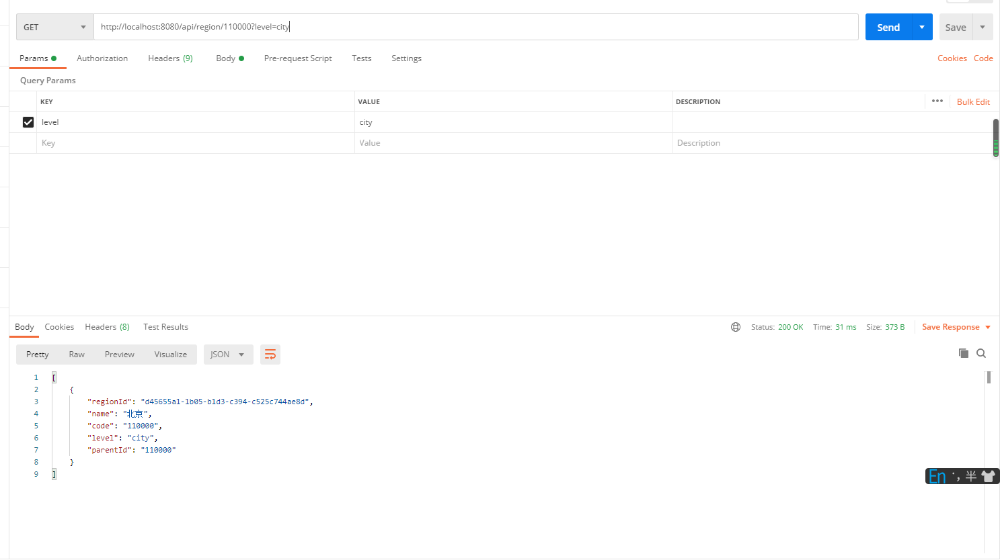
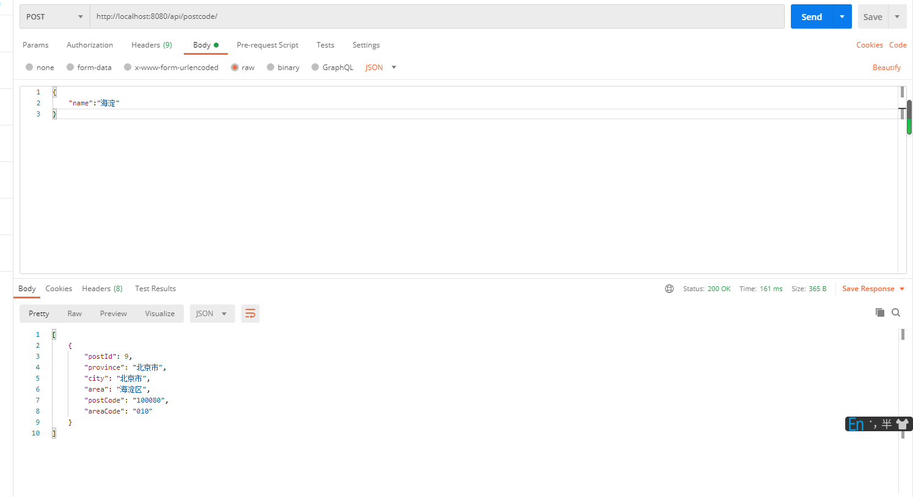

 

# 简介
全国行政区域api， 包括省，市，区，县，镇，街道

全国区域邮政编码 电话区号

数据持续更新中。。。

[获取数据](https://github.com/lizeze/china_region)
# API
 ## 获取行政区域数据

 
   GET  `http://localhost:8080/api/region/{parentId}?level={level}`
   
 *  `parentId`为父节点编号
   
 *  `level`为请求数据的级别(**非必填**)
     
     `province`  `city`  `district`  `street`
      
    
   
   调用方式
   
  > level 字段非必填，但是在请求直辖市数据的时候可能会有数据重复的问题,如果不添加的话需要在显示的时候单独处理一下，如果加上之后可以避免这个问题
## 获取区域邮政编码与区号
POST `http://localhost:8080/api/postcode/`

调用方式

   

